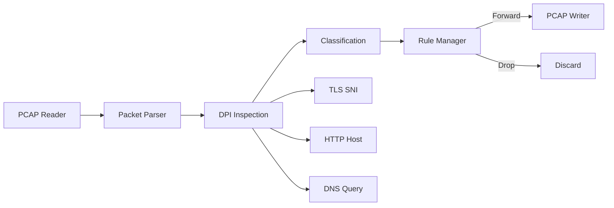
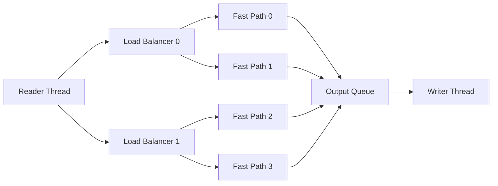

# Deep Packet Inspection System (DPI Engine)

[](LICENSE)
[](https://www.python.org/)

A production-quality, self-contained deep packet inspection (DPI) engine for **offline PCAP analysis**. It parses Ethernet/IPv4/TCP/UDP headers, extracts TLS SNI / HTTP Host / DNS queries, classifies traffic by application, and applies configurable blocking rules before writing a filtered PCAP.

> **Scope**: This project processes *PCAP files* (not live traffic) and does **not** decrypt TLS. It focuses on fast, deterministic classification using protocol metadata.

## Table of Contents
- [Key Features](#key-features)
- [Architecture](#architecture)
- [How It Works](#how-it-works)
- [Project Structure](#project-structure)
- [Requirements](#requirements)
- [Installation](#installation)
- [Quick Start](#quick-start)
- [CLI Usage](#cli-usage)
- [Rules File Format](#rules-file-format)
- [Testing](#testing)
- [Performance & Scalability](#performance--scalability)
- [Security & Privacy Considerations](#security--privacy-considerations)
- [Limitations](#limitations)
- [Contributing](#contributing)
- [License](#license)

## Key Features
- **Protocol Parsing** — Ethernet, IPv4, TCP, and UDP header parsing
- **Metadata Extraction** — TLS SNI, HTTP `Host`, and DNS query parsing
- **Application Classification** — heuristic mapping of SNI/hostnames to 20+ common apps
- **Rule-Based Blocking** — block by IP, app, domain (substring/wildcard), or port
- **Two Execution Modes** — single-threaded engine and multi-threaded LB/FP pipeline
- **PCAP Output** — writes a filtered PCAP with blocked packets removed
- **Standard Library Only** — no external runtime dependencies

## Architecture

### High-Level Pipeline


### Multi-Threaded Pipeline


### Key Design Notes
- **Five-tuple flow tracking**: all packets in a flow are processed together.
- **Consistent hashing**: ensures flow affinity for multi-threaded processing.
- **Deterministic decisions**: blocking rules are evaluated in a fixed order for consistency.

## How It Works
1. **Parse headers** to extract Ethernet/IPv4/TCP/UDP metadata.
2. **Inspect payload** for TLS ClientHello (SNI), HTTP Host, and DNS queries.
3. **Classify traffic** using SNI/host/port heuristics (fallback to port if needed).
4. **Apply rules** (IP → Port → App → Domain) to decide forward/drop.
5. **Write output** PCAP containing only forwarded packets.

## Project Structure
```
├── dpi/                        Core engine package
│   ├── __init__.py             Package exports
│   ├── types.py                Enums, data classes, SNI→App mapping
│   ├── pcap_io.py              PCAP file reader and writer
│   ├── packet_parser.py        Ethernet/IPv4/TCP/UDP protocol parsing
│   ├── sni_extractor.py        TLS SNI, HTTP Host, DNS extractors
│   ├── rule_manager.py         Blocking rules (IP, App, Domain, Port)
│   ├── connection_tracker.py   Flow table and connection state
│   ├── engine.py               Single-threaded DPI engine
│   └── engine_mt.py            Multi-threaded DPI engine
│
├── cli.py                      Command-line interface
├── generate_test_pcap.py       Test PCAP generator
├── test_dpi.pcap               Sample capture for testing
├── tests/                      Unit + integration tests
├── requirements.txt            Dependencies (stdlib only)
└── README.md
```

## Requirements
- **Python 3.8+**
- No external dependencies (standard library only)

## Installation
```bash
git clone https://github.com/Rekh-225/Deep-Packet-Inspection-System.git
cd Deep-Packet-Inspection-System
```

## Quick Start
```bash
python cli.py test_dpi.pcap output.pcap
```

### Block Specific Traffic
```bash
# Block an application
python cli.py capture.pcap filtered.pcap --block-app YouTube

# Block an IP address
python cli.py capture.pcap filtered.pcap --block-ip 192.168.1.50

# Block a domain (substring match)
python cli.py capture.pcap filtered.pcap --block-domain tiktok

# Combine multiple rules
python cli.py capture.pcap filtered.pcap \
  --block-app YouTube \
  --block-app TikTok \
  --block-ip 192.168.1.50 \
  --block-domain malware.example.com
```

### Multi-Threaded Mode
```bash
# Default: 2 load balancers, 2 fast-path threads per LB (4 total)
python cli.py capture.pcap filtered.pcap --mode mt

# Custom thread count
python cli.py capture.pcap filtered.pcap --mode mt --lbs 4 --fps 4
```

## CLI Usage
```text
usage: cli.py [-h] [--block-ip IP] [--block-app APP] [--block-domain DOMAIN]
              [--block-port PORT] [--rules-file FILE]
              [--mode {simple,mt}] [--lbs N] [--fps N]
              input output

positional arguments:
  input                 Input PCAP file path
  output                Output PCAP file path (filtered)

blocking rules:
  --block-ip IP         Block traffic from source IP (can be repeated)
  --block-app APP       Block application: YouTube, Facebook, TikTok, etc.
  --block-domain DOMAIN Block domain by substring match (can be repeated)
  --block-port PORT     Block destination port (can be repeated)
  --rules-file FILE     Load blocking rules from a file

engine mode:
  --mode {simple,mt}    simple (single-threaded) or mt (multi-threaded)
  --lbs N               Number of load balancer threads (mt mode, default: 2)
  --fps N               Fast-path threads per LB (mt mode, default: 2)
```

## Rules File Format
The engine supports loading/saving rules in a simple INI-like format:
```ini
[BLOCKED_IPS]
192.168.1.50

[BLOCKED_APPS]
YouTube
TikTok

[BLOCKED_DOMAINS]
*.facebook.com
malware.example.com

[BLOCKED_PORTS]
443
```

**Notes**
- Domain rules support **substring** and **wildcard** matching (e.g., `*.example.com`).
- Rule evaluation order: **IP → Port → App → Domain**.

## Testing
```bash
python -m unittest discover -s tests
```

## Performance & Scalability
- The multi-threaded engine distributes flows across fast-path threads via consistent hashing.
- Throughput scales with CPU cores for flow-heavy PCAPs; real-world performance depends on capture size and traffic mix.

## Security & Privacy Considerations
- DPI inspects metadata (SNI/Host/DNS) that may include sensitive identifiers.
- Use only on traffic you are authorized to analyze.
- This tool does **not** decrypt TLS and does not attempt to bypass encryption.

## Limitations
- **IPv4 only** (non-IPv4 frames are ignored).
- **Offline PCAP processing** only (no live capture).
- **Heuristic classification** based on SNI/hostnames/ports; false positives are possible.

## Contributing
Issues and pull requests are welcome. For large changes, please open an issue first to discuss scope and design.

## License
Licensed under the [MIT License](LICENSE).
