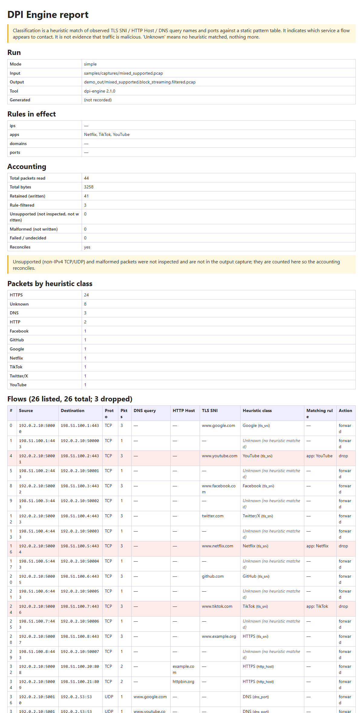

# DPI Engine

**An offline deep-packet-inspection tool that reads a network capture, works out which services each connection was talking to, filters packets by rule, and writes a new capture plus a report, without ever producing a half-finished result.**

Pure Python, standard library only, one `pip install`. Built as a learning project in network security and concurrent systems, and then reworked after a line-by-line review found that the original multi-threaded engine could silently lose packets. The second half of this README is about what that review found and how it was fixed, because that is where most of the engineering is.

```bash
pip install .
dpi-engine capture.pcap filtered.pcap --block-app YouTube --report-html report.html
```

---

## Contents

- [Who this is for](#who-this-is-for)
- [What it does](#what-it-does)
- [Quick start](#quick-start)
- [Using it](#using-it)
  - [Rules](#rules)
  - [Reports](#reports)
  - [Exit status: what the number means](#exit-status-what-the-number-means)
  - [Multi-threaded mode](#multi-threaded-mode)
- [How it works](#how-it-works)
- [What it will not do](#what-it-will-not-do)
- [The engineering story](#the-engineering-story)
- [Guarantees, limits and accounting](#guarantees-limits-and-accounting)
- [Tests and benchmarks](#tests-and-benchmarks)
- [Repository layout](#repository-layout)
- [License](#license)

---

## Who this is for

- **Students and self-learners** who want to see, concretely, what a network capture contains, how encrypted traffic still reveals the server it is talking to, and how a packet filter decides what to drop. Everything runs on the synthetic samples in this repo; you do not need to capture anything yourself.
- **People cleaning up a capture** before sharing it: strip a particular device, a streaming service, or a domain out of a `.pcap` and get an exact account of what was removed.
- **Anyone interested in concurrent pipelines in Python**: the multi-threaded engine is a small but complete worked example of bounded queues, ordered output, clean shutdown, cancellation and honest failure accounting, with a deterministic test for every one of those properties.

If you have never worked with packets before, the short glossary at the start of [How it works](#how-it-works) covers everything you need.

## What it does

Given a saved capture (`.pcap`), the engine:

1. Reads every packet in order and checks that it is structurally sound. Damaged packets and kinds of traffic the tool does not understand (IPv6, ARP, fragments, ...) are counted and set aside, never guessed about.
2. Groups packets into flows (conversations between two endpoints) and looks for the three names that stay visible even when traffic is encrypted: the **TLS server name (SNI)**, the **HTTP `Host` header**, and **DNS query names**.
3. Labels each flow by matching that name against a small table of well-known services (YouTube, Netflix, GitHub, Facebook, Zoom, ...). No match means the honest label **Unknown**. A label is only "this flow appears to contact that service"; the tool never presents it as evidence of anything malicious, and the reports say so in as many words.
4. Applies your rules (block by app, domain, source IP, destination port) and writes a **new capture with the matching packets removed**. Retained packets are byte-for-byte identical, in their original order, with their original timestamps and lengths.
5. Prints a summary, and optionally writes a **JSON report** (for scripts) and a **static HTML report** (for people) listing every flow: endpoints, observed names, label, matching rule, final action, and a packet tally that must add up before the run is declared a success.

It works on files only. It does not capture live traffic and it is not a firewall.

## Quick start

Requires Python 3.8 or newer. There are no third-party dependencies.

```bash
git clone https://github.com/Rekh-225/Deep-Packet-Inspection-System.git
cd Deep-Packet-Inspection-System
python -m pip install .
dpi-engine --version
```

Then run the demo. It processes the bundled synthetic captures with three rule sets and deliberately feeds the tool one broken file so you can see how it refuses:

```bash
python demo.py
```

Filtered captures and reports land in `demo_out/`. Open any `.report.html` in a browser.

You can also run from the checkout without installing: `python cli.py ...` or `python -m dpi ...` take exactly the same arguments.

## Using it

```bash
# Inspect only: keep everything, write a report of what is in the file
dpi-engine capture.pcap out.pcap --report-html report.html

# Remove two streaming services and everything sent by one machine
dpi-engine capture.pcap out.pcap --block-app YouTube --block-app Netflix --block-ip 192.168.1.50

# Remove anything whose name mentions "tiktok", plus all DNS on port 53
dpi-engine capture.pcap out.pcap --block-domain tiktok --block-port 53

# Same rules from a file, JSON report for further processing
dpi-engine capture.pcap out.pcap --rules-file my.rules --report-json run.json
```

The console summary looks like this (a real run over `samples/captures/mixed_supported.pcap` with `samples/rules/block_streaming.rules`):

```
║ Total Packets:              44                           ║
║ Retained (written):         41                           ║
║ Rule-filtered:               3                           ║
║ Unsupported:                 0                           ║
║ Malformed:                   0                           ║
║ Active Flows:               26                           ║
╠══════════════════════════════════════════════════════════════╣
║                   APPLICATION BREAKDOWN                    ║
║ HTTPS                 24  54.5% ##########            ║
║ Unknown                8  18.2% ###                   ║
║ DNS                    3   6.8% #                     ║
║ YouTube                1   2.3%                       ║
║ Netflix                1   2.3%                       ║
║ TikTok                 1   2.3%                       ║
...
[Detected Applications/Domains]
  - www.netflix.com -> Netflix
  - github.com -> GitHub
  - www.example.org -> HTTPS
```

`Retained + Rule-filtered + Unsupported + Malformed` always equals `Total`. If it does not, the run fails instead of printing the table.

### Rules

Four kinds, combinable, repeatable on the command line or grouped in a file:

| Rule | Flag | Matches |
|---|---|---|
| Application | `--block-app YouTube` | flows classified as that app (see the table in [How it works](#how-it-works)) |
| Domain | `--block-domain tiktok` or `--block-domain "*.example.com"` | case-insensitive substring, or suffix wildcard, against the observed SNI / Host / DNS name |
| Source IP | `--block-ip 192.168.1.50` | packets **from** that address |
| Destination port | `--block-port 53` | packets **to** that port |

A rules file is plain text with four optional sections:

```ini
[BLOCKED_IPS]
192.168.1.50

[BLOCKED_APPS]
YouTube
Netflix

[BLOCKED_DOMAINS]
tiktok
*.ads.example

[BLOCKED_PORTS]
53
```

Once a flow matches a rule, every later packet in that flow direction is dropped too. Blocking is directional, which matches how the original single-threaded engine behaved: a rule that matches a client's TLS handshake blocks client-to-server packets from that point on; the server's replies are not blocked.

### Reports

```bash
dpi-engine capture.pcap out.pcap --report-json run.json --report-html run.html
```

Both reports contain the same data: the run's accounting and rules, and one entry per flow with its endpoints, packet and byte counts, the observed TLS SNI / HTTP Host / DNS name (kept as three separate fields), the heuristic label, the rule that matched, and the final action. Sample reports are in [`samples/reports/`](samples/reports/).

This is the HTML report for the run shown above (`mixed_supported.pcap` with YouTube, Netflix and TikTok blocked). Dropped flows are highlighted, the caveat about heuristic classification is the first thing on the page, and the accounting block shows the totals reconciling:

<p align="center">
  
</p>

<sub>Rendered from <code>samples/reports/mixed_supported.block_streaming.report.html</code>, a synthetic capture; all addresses are from IANA documentation ranges.</sub>

Two things worth knowing:

- The HTML is static: no JavaScript, a restrictive Content-Security-Policy, and every captured string is HTML-escaped and length-clipped. The `hostile_names` sample carries names like `<script>alert(1)</script>` specifically to prove this.
- Reports are bounded. By default at most 1 000 flows are listed (`--report-max-flows`), and the true total is always recorded alongside. Aggregate counts are exact regardless of the cap.

### Exit status: what the number means

Automation should be able to trust the exit code, so each one means exactly one thing:

| Code | Meaning | Is there an output `.pcap`? |
|---|---|---|
| `0` | complete output written, and every requested report | yes, complete |
| `1` | processing failed: unreadable, unsupported or truncated input, unwritable output, worker error, flow limit exceeded, accounting mismatch | **no** |
| `2` | usage error, or the `--rules-file` could not be loaded | no |
| `3` | **capture completed; report failed**: the `.pcap` is complete, but at least one report could not be written. stderr lists which outputs exist and which failed | yes, complete |
| `130` | cancelled with Ctrl-C before the output was committed | no |

The output file is written to a uniquely named temporary file next to the destination and moved into place only at the very end, after every packet has been accounted for. Whatever goes wrong, you will never find a partial `.pcap` at the destination path.

### Multi-threaded mode

```bash
dpi-engine capture.pcap out.pcap --mode mt              # 2 load balancers x 2 workers
dpi-engine capture.pcap out.pcap --mode mt --lbs 4 --fps 2
```

Both modes produce **byte-identical output and identical statistics** for the same input and rules; the test suite asserts this across several thread layouts.

Be aware that `mt` mode is **not faster** in CPython. The work is pure Python under the GIL and every packet crosses three queues. Measured on a 51 000-packet synthetic capture on one Windows laptop (Python 3.13, best of 3): `simple` about 46 000 packets/s, `mt` about 27 000 to 29 000 packets/s for every layout tried. The mode exists to demonstrate a *correct* pipelined design, and the benchmark exists to keep that claim honest. Details in [`benchmarks/README.md`](benchmarks/README.md).

## How it works

**A five-line glossary.** Network data travels as *packets*, each with addressing headers and a payload. A *`.pcap` file* is a recording of packets made by a tool like Wireshark or `tcpdump`. A *flow* is all packets between the same two endpoints (IP address + port on each side, plus protocol). Most traffic today is encrypted with *TLS*, but the very first message of a TLS connection carries the server's name in clear text, the *SNI*. *DNS* is the lookup that turns a name into an address, and it is also sent in clear text.

### Pipeline

```
 .pcap ──► Reader ──► Parser ──► Inspector ──► Classifier ──► Rules ──► Writer ──► .pcap
           frames    Ethernet    TLS SNI       name ──► app    keep /    ordered,
           in order  IPv4        HTTP Host     or Unknown      drop      atomic
                     TCP/UDP     DNS query
```

1. **Reader** (`dpi/pcap_io.py`) validates the file header, then yields records with their timestamp, captured length and original wire length. Anything that is not a classic Ethernet `.pcap` is rejected up front with a specific message.
2. **Parser** (`dpi/packet_parser.py`) walks Ethernet, IPv4 and TCP/UDP headers, checking every declared length against every other and against the bytes actually present. Transport parsing is confined to the IP datagram, so Ethernet padding is never mistaken for payload.
3. **Inspector** (`dpi/sni_extractor.py`) tries to read a TLS ClientHello SNI (port 443), an HTTP `Host` (port 80) or a DNS question name (port 53) from the payload. Every length field must be internally consistent; if the message is truncated or malformed the result is *no name*, never a partial one.
4. **Classifier** (`dpi/types.py`, `dpi/inspection.py`) maps the name to an application via a pattern table, falls back to a port-based `HTTPS` / `HTTP` / `DNS` label, and otherwise says `Unknown`.
5. **Rules** (`dpi/rule_manager.py`) decide keep or drop per flow; the flow's state (`dpi/connection_tracker.py`) remembers the decision for the rest of the flow.
6. **Writer** writes retained packets, in input order, to a temporary file that is committed only when the accounting reconciles.

The classification and rule logic lives in one module (`dpi/inspection.py`) that both engines call, which is why they cannot drift apart.

### Recognised applications

| Application | Name patterns | | Application | Name patterns |
|---|---|---|---|---|
| YouTube | `youtube`, `ytimg`, `youtu.be` | | Discord | `discord`, `discordapp` |
| Google | `google`, `googleapis`, `gstatic` | | Spotify | `spotify`, `scdn.co` |
| Facebook | `facebook`, `fbcdn`, `meta.com` | | Zoom | `zoom` |
| Instagram | `instagram`, `cdninstagram` | | Telegram | `telegram`, `t.me` |
| Twitter/X | `twitter`, `twimg`, `x.com` | | WhatsApp | `whatsapp`, `wa.me` |
| Netflix | `netflix`, `nflxvideo` | | GitHub | `github`, `githubusercontent` |
| TikTok | `tiktok`, `bytedance` | | Amazon/AWS | `amazon`, `amazonaws`, `cloudfront` |
| Microsoft | `microsoft`, `azure`, `office` | | Apple | `apple`, `icloud`, `itunes` |
| Cloudflare | `cloudflare` | | DNS / HTTP / HTTPS | by port, when no name matched |

This is a substring match on a hostname. It is deliberately simple and it is a heuristic: it tells you which service a flow *appears* to contact, and nothing more.

## What it will not do

Being clear about scope is part of the design. The engine:

- **Reads files only.** No live capture, no interception, no injection.
- **Accepts classic `.pcap` on Ethernet only.** `.pcapng`, nanosecond-timestamp `.pcap`, and other link types are rejected with exit 1. Convert first with `editcap -F pcap in.pcapng out.pcap` (Wireshark tools).
- **Inspects IPv4 TCP and UDP only.** IPv6, ARP, ICMP, VLAN-tagged frames and IPv4 fragments are counted as *unsupported* and excluded from the output. They are never forwarded uninspected.
- **Does not reassemble TCP streams.** A TLS handshake or HTTP request split across segments is not recognised; the flow keeps its port-based label.
- **Does not decode QUIC, HTTP/2, DNS responses, DNS-over-TCP names, DoH/DoT, or ESNI/ECH.**
- **Excludes what it cannot inspect.** With no rules, a capture made only of supported packets is reproduced exactly; a capture containing other protocols is not, and the summary says so.

The full protocol-by-protocol contract, including which malformed conditions are detected, is in [`docs/USAGE.md`](docs/USAGE.md).

## The engineering story

The first version of this project had a working single-threaded engine and a multi-threaded engine that *appeared* to work: it ran, printed a report, and wrote an output file. A careful review, reproducing each suspicion with a deterministic test before touching any code, found that it was quietly wrong in several ways:

- **It stopped on a timer.** Shutdown was "sleep, then clear a running flag". Any packet still in a queue when the timer fired was dropped, and the run reported success.
- **It swallowed worker errors.** An exception in a worker thread printed a traceback and the main thread carried on, committing whatever output existed.
- **It wrote packets in completion order, not input order.** A slow worker meant a scrambled capture.
- **Half its workers never received a packet.** Routing used `hash % 2` twice in a row, so the two choices were correlated and two of the default four workers sat idle.
- **Its accounting ignored packets it could not parse**, so the totals did not match the single-threaded engine on the same file.

Fixing these properly meant redesigning the pipeline around explicit completion rather than time: every packet receives a contiguous id; a bounded window of admitted-but-unfinished packets provides backpressure and bounds every queue; each stage propagates an end-of-input sentinel and posts a done marker; the writer retires packets strictly by id; and the output is committed only when every id has been retired and the categories sum to the total. Every blocking operation polls a shared stop flag, so a failure in one stage unwinds all of the others even with every queue full.

A second review of the repaired engine then found a further set of subtler problems, each again reproduced before being fixed:

| Finding | What could happen | Fix |
|---|---|---|
| Flow table capacity scaled with thread count | after 100 000 flows a blocked flow's state was evicted in one mode but not the other, so the two engines produced different output and a blocked flow slipped through | one global `--max-flows` limit shared by both engines; exceeding it is a controlled failure, never silent eviction |
| IPv4 / UDP lengths not validated | inconsistent packets were forwarded; a fragment's payload could be misread as a TCP header and matched by a port rule | every length checked against every other; fragments are unsupported and never transport-parsed |
| Ctrl-C while joining threads | skipped cleanup, left a `.partial` file open and two threads alive | the whole lifecycle is under one interruption-safe path that cancels, joins, closes and discards, tolerating repeated interrupts |
| Truncated TLS / DNS payloads | yielded partial names (`www`) that could match domain rules | strict bounds on every TLS and DNS length field; malformed application data yields no name |
| Original wire length lost | output records said 54/54 where the input said 54/60 | `orig_len` carried through the job to the writer |
| Fixed `output.partial` temp name | could truncate and then delete a user's file of that name | exclusively-created unique temp file; failures normalised to one exception type; cleanup leftovers named, never hidden |
| Aborted runs called every unretired packet "undecided" | diagnostics overstated how much work was lost | separate admitted / decided / retired counters with precise definitions |
| Report detail unbounded | detection history grew without limit on large captures | bounded detail with explicit truncation notice; aggregates stay exact |
| Report failure returned exit 1 | callers could not tell "no output" from "output fine, report failed" | distinct exit 3, "capture completed; report failed" |

Every row in that table has a regression test named after it. The full write-up with root causes and the resulting contracts is in [`docs/REVIEW_REPAIRS.md`](docs/REVIEW_REPAIRS.md).

The takeaway this project is meant to demonstrate is not "multi-threading is hard", although it is. It is that a program can run, print a plausible report and exit zero while being wrong, and that the cure is to make success a *proven* state (ids retired, categories reconciled, file committed) rather than the absence of a visible crash.

## Guarantees, limits and accounting

**Packet categories.** Every packet read lands in exactly one:

| Category | Meaning | In output? |
|---|---|---|
| Retained | IPv4 TCP/UDP, no rule matched | yes |
| Rule-filtered | IPv4 TCP/UDP, flow matched a rule | no |
| Unsupported | parsed, but not IPv4 + TCP/UDP (ARP, IPv6, ICMP, VLAN, fragments) | no |
| Malformed | headers truncated or inconsistent with each other or with the captured bytes | no |

Structural checks come first: a packet that is both inconsistent and of an unsupported type is *malformed*. A `.pcap` record whose original length exceeds its captured length is fine as long as the IP datagram is complete within the captured bytes.

**Aborted runs** (failure or Ctrl-C) report *admitted* (read and given an id), *decided* (outcome determined, possibly still waiting in the reorder buffer), *retired* (written or accounted in order), *undecided* (admitted minus decided), and whether the input was fully read. The number of unread packets is not guessed.

**Limits**, each independent and each documented:

| Limit | Flag | Default | What it bounds |
|---|---|---|---|
| Packet window | `--queue-size N` (mt) | 10 000 | packets admitted but not yet retired: every queue and the reorder buffer |
| Flow state | `--max-flows N` | 200 000 | tracked flows for the run, identical in both modes; exceeding it fails the run |
| Report detail | `--max-report-detail N` | 10 000 | detected names and blocked-flow entries kept; overflow is counted and shown |
| Report flow list | `--report-max-flows N` | 1 000 | flows listed in JSON/HTML; the true total is always recorded |

`--queue-size` bounds in-flight packets, not total process memory: flow state grows with distinct flows up to `--max-flows`, and report detail up to `--max-report-detail`.

**Routing** in `mt` mode hashes the canonical five-tuple (endpoints sorted, so both directions agree), derives the load-balancer index and the worker index from independent parts of the hash so every worker is reachable, and pins each flow to one worker so flow state needs no locking. Flow *state* remains directional, matching the single-threaded engine.

## Tests and benchmarks

```bash
python -m unittest discover -s tests                          # full suite, ~50 s
DPI_SKIP_INSTALL_TEST=1 python -m unittest discover -s tests  # ~20 s; skips the clean-venv install test
python samples/make_samples.py --check                        # samples match their generator byte-for-byte
python benchmarks/bench.py                                    # throughput + classification agreement
python tools/make_release.py                                  # local release archive under release/
```

The suite has 250 tests. Beyond unit tests per module, it covers: routing across all workers; order preservation with slow and out-of-order workers; queues smaller than the input; every stage failing with full queues; Ctrl-C injected at each lifecycle phase, including repeated interrupts and failing cleanup; simple/mt byte equivalence across rule sets and layouts; flow-capacity behaviour below, at and beyond the limit in both modes; hostile-string escaping in HTML; every exit code; and a fresh-virtualenv `pip install` followed by a `dpi-engine` smoke test. Concurrency tests use events and gates, not sleeps.

Test fixtures are built by an independent packet crafter (`tests/fixtures.py`) with expectations stated by construction ("44 supported, 3 unsupported, 1 malformed"), so tests do not merely compare the engine against its own earlier output. The sample captures are fully synthetic, generated from IANA documentation address ranges; no real traffic was recorded.

CI (`.github/workflows/ci.yml`) runs the suite on Linux and Windows across Python 3.8 to 3.13.

The benchmark reports throughput and, separately, agreement with the generator's ground-truth labels on synthetic single-segment traffic. It is not a real-world accuracy measurement and the output says so.

## Repository layout

```
dpi/                      the engine package
  pcap_io.py              strict .pcap reader; atomic writer
  packet_parser.py        Ethernet / IPv4 / TCP / UDP with full boundary checks
  sni_extractor.py        TLS SNI, HTTP Host, DNS question extractors
  inspection.py           shared classify + rule decision, detection log
  connection_tracker.py   flow table with a shared global capacity
  rule_manager.py         rules and rules-file parsing
  engine.py               single-threaded engine (the reference)
  engine_mt.py            multi-threaded engine
  report.py               bounded JSON / escaped static HTML
  cli.py, __main__.py     dpi-engine command, python -m dpi
tests/                    250 unittest tests; fixtures.py is the independent packet crafter
samples/                  synthetic captures, rule files, expected.json, sample reports
docs/USAGE.md             concise usage guide and the supported-input contract
docs/REVIEW_REPAIRS.md    review findings, root causes, resulting contracts
benchmarks/               bench.py and the last measured run
tools/make_release.py     builds a local wheel + source archive + SHA256SUMS
demo.py                   runs the samples and writes demo_out/
cli.py                    compatibility launcher for python cli.py
```

## License

MIT. See [`LICENSE`](LICENSE).
